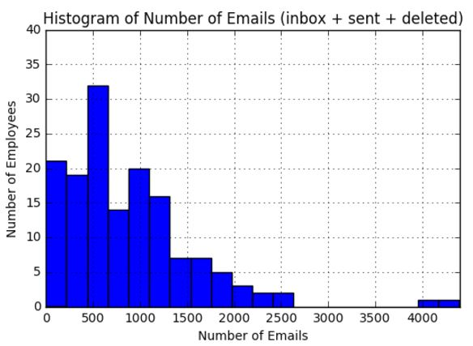
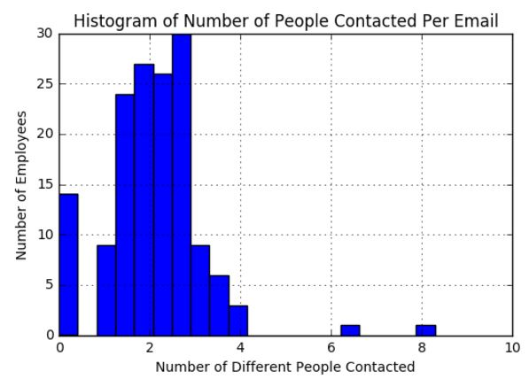

# Midterm Question 1
### Requirements:
* Using Enron Data set, perform 3 analyses

## Preface:

As I am not interested in the finance sector or investigative inquiry for law enforsement, I analyzed the data set from a Human Factors perspective. This data set has a large number of users and a large number of emails, allowing potential insight into how employees use their corporate email accounts.

## Analysis \# 1: Number of Emails Stored per Employee in Main Folders

### Introduction:

I first wanted to understand how much people were using their corporate email accounts at the time of the enron scandal. This will tell how much people were using their email for communication as opposed to other means.

To get an estimate of email account usage per employee, I summed up the total number of emails in their inbox, sent folder, and deleted items folder and plotted these results on a histogram.

### Analysis:

This histogram is unimodal and skewed to the left with very few people having sent over 2000 emails. This can indicate either a turnover rate of employees within the compoany or limited use of email for communication.

People who had over 2000 emails:
* dasovich-j
* kaminski-v
* steffes-j
* lay-k
* shackleton-s
* parks-j
* nemec-g
* presto-k
* germany-c

## Analysis \# 2: Number of Unique People Emailed Per Employee

### Introduction:

Next, I wanted to see how many different people each employee would contact. To do this, I scanned all sent items from each employee's inbox and recorded all email addresses they contacted. I then removed the duplicates from this list to get the number of unique email addresses contacted.

### Analysis:

This histogram shows a vaguely exponential distribution with more people only contacting a few people and a few employees emailing large numbers of different email addresses.

## Analysis \# 3: Average Number Times Each Person is Contacted

### Introduction:

Finally, I wanted to see the average number of times each eployee contacted each person they communicated with. I scanned each employee's emails to find the email addresses of people they emailed. I took the average of this number across all emails for each employee and then plotted each employee's average contact rate on a historgram.

### Analysis:

This histogram is unimodal with few outliers. It has a mean of 2.057 people and a mode of rouchly the same value. This means that each employee contacts each other person, on average, two times. This indicates that employees often converse brifly with people outside their frequent contacts.