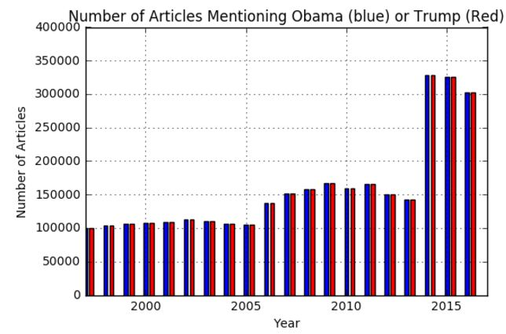

# Midterm Question 2
### Requirements:
- You would need to create an API key.
- Use `request` or `beautiful-soap` library to download the data. (No other library or crawler allowed).
- Store the data in your local machine.
- Your analysis should use **this downloaded data only** (and not try to redownload this data again during analysis time).
-  There is a rate limit for downloading the data. I would suggest you to start collecting the data from day 1. You can try using multiple account to get more than 1 key.
-  You need to use atleast 2 API method eg: `archive`, `Article Search`. **Do not use** `Movies Review`, `Semantic` API.

## Preface:

I was intested in analysing this data set to help me understand the current dramatic political movement. I do not support the alt-right movement, but am interested in it's sudden appearance in media due to the Trump campaign and presidency. 

## Analysis \# 1: Number of Articles Containing the term "alt-right" over time

### Introduction:

I understand that the "alt-right" campaign has existed for quite some time, but hasn't been as vocal before they got a political canidate on their side. I wanted to see how bit a spike Trump caused and if there was a similar rise during the Obama campaign and presidency.

To do this, i searched for all articles that triggered the query "alt-right" using the New York Times Article Search API for the last 25 years. I stored each year's data in seprate json files, then plotted the number of results from each year in a bar chart.

### Analysis:

This chart was interesting to me for a number of reasons. First, the amount of artiles mentioning the alt-right sharply increased around the announcement of the Trump canidancy. This was to be expected, but the frequency more than doubled from the previous year and there was no gradual increase.

Additionally, while there was an increase during the Obama administration, it was a small increase compared to the Bush years, and lowered towards the last years of his presidency.

## Analysis \# 2: Top Words in Recent Popular Article Titles

### Introduction:

Next, I wanted to see the distribution of words in recent popular article titles. I think this is useful to unserstand current trends.

### Analysis:

I used the Most Shared section of the Most Popular API to get the last 30 days of articles that were the most popular New York Times articles on social media. I then recorded this data into a JSON file and then extracted the titles. I split the titles into words and removed all stop words using the NLTK stopwords corpus. Next, I counted the frequency of each word and found the top 6 most popular words.

### Results:

My analysis found that the most popular words from these titles are:

* "trump" (count = 7)
* "devos" (count = 3)
* "intelligence" (count = 2)
* "russian" (count = 2)
* "betsy" (count = 2)
* "administration" (count = 2)

## Analysis \# 3: Trump and Obama's number of articles over the last 20 years

### Introduction:

Finally, I wanted to see the trends in the nations attention for Trump and Obama. Specifically, I wanted to see if Obama was discussed in the beginning of his presidency as much as Trump is now.

### Analysis:

